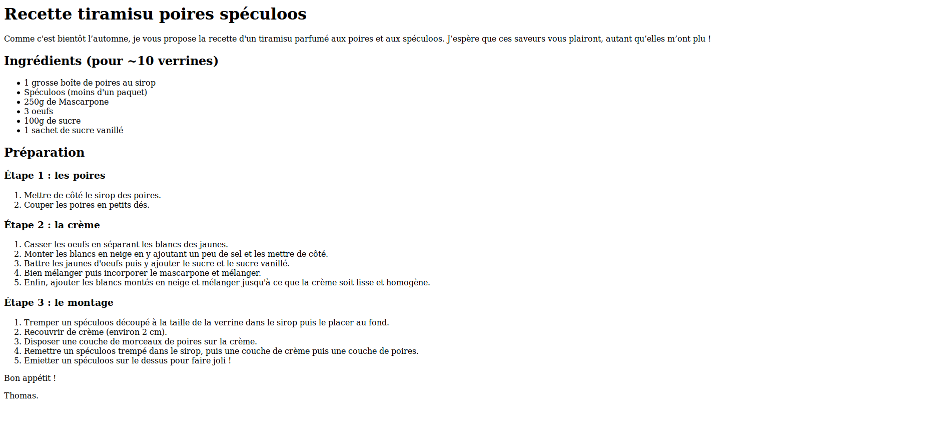
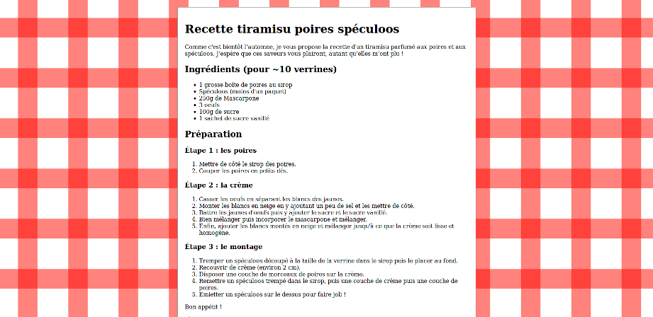
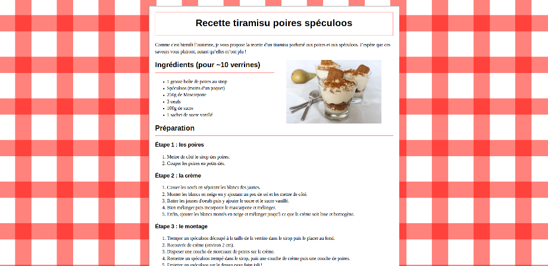
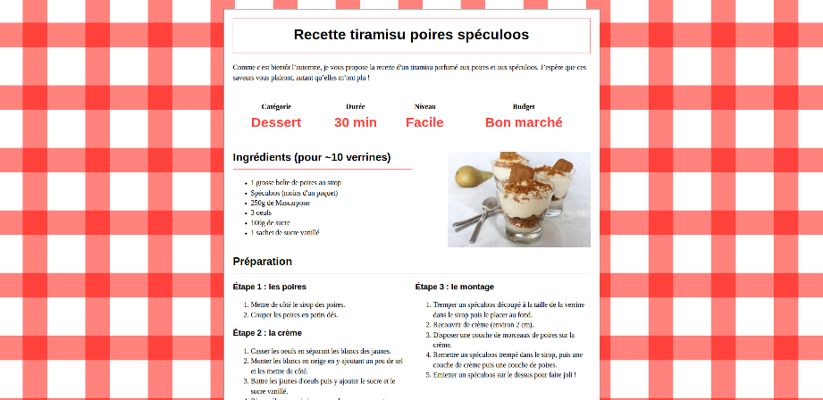
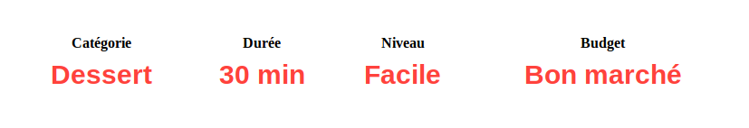
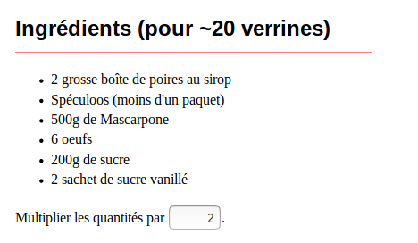

La Recette de Tiramisu
======

Notre TP du jour a pour objectif de la mettre en forme une recette de cuisine.

Vous trouverez 4 dossiers avec ces instructions :

 * `assets` : contient tout ce dont vous aurez besoin pour réaliser votre TP ;
 * `screenshots` : contient des captures d'écrans des différentes parties ;
 * `solutions` : contient les solutions du TP. À utiliser intelligemment ;
 * `workspace` : c'est votre dossier. Il contiendra bientôt votre TP. 
  
## Partie 1

Voici à quoi devrait ressembler votre TP, à la fin de cette partie :

### 1.1 Du texte à l'HTML

Vous trouverez dans le dossier `assets` un fichier nommé `index.txt` qui contient la recette de cuisine.

 1. Ouvrez le fichier `index.txt` directement avec un navigateur.
 2. Copier le fichier en `index.html` dans votre dossier `workspace`
 3. Ouvrir le fichier `index.html` avec votre navigateur.

> Quelle différence constatez-vous ?  
  Comment l'expliquez-vous ?

### 1.2 Encodage

En fonction de votre système d'exploitation et de votre navigateur, vous pouvez avoir constaté des problèmes d'encodage.

> Ajouter une balise `<meta>` avec les bons attributs pour déclarer votre fichier en `utf-8`.

### 1.3 Titre navigateur

> Ajouter une balise `<title>` pour décrire le nom que devra afficher le navigateur dans son onglet.  
  Quel titre avez-vous choisi ?

### 1.4 Titres de page

En HTML, on décrit nos titres à l'aide des balises `<h1>`, `<h2>`, `<h3>`, `<h4>`, `<h5>` et `<h6>`,
respectivement du plus important au moins important.

> Baliser les titres de la page de la recette de cuisine.  
  Quelle balises avez-vous choisies ?
    
### 1.5 Listes et paragraphes

En HTML, on décrit les éléments d'une liste à l'aide de la balise `<li>`.
Ceux-ci doivent être englobés par une balise `<ol>` ou `<ul>`, respectivement pour les listes ordonnées et non-ordonnées.
Pour les paragraphes, un autre type de contenu, on utilise la balise `
`.

La norme HTML définit des règles de descendance sur ces balises :
les paragraphes ne peuvent contenir ni titre ni liste, et les listes ne peuvent pas contenir autre chose que des éléments de liste.  

> Baliser les listes et les paragraphes de la page de la recette de cuisine.  
  Quelle balises avez-vous choisies ?
  
### 1.6 Le coprs et la tête

On est partis un peu sur les chapeaux de roues, et on a peut-être oublié quelques éléments essentiels d'une page HTML.

> Pensez-vous que votre code respecte la norme w3c ?  
  Combien d'erreurs à votre avis ?
          
Pour en avoir le coeur net, voici le validateur officiel : <https://validator.w3.org/#validate_by_input>.

Pour cela, on va rajouter certaines balises que l'on n'avait pas précisées car elles étaient implicites.
C'est-à-dire que si on ne les ajoute pas nous-même, le navigateur les aujoutera pour nous.

> Ajouter un doctype au début de votre fichier  
  Ajouter une balise `<html>` autour de toutes les balises  
  Ajouter une balise `<head>` autour des balises `<meta>` et `<title>`  
  Ajouter une balise `<body>` autour du reste des balises (votre contenu)  
    
Un dernier détail qui a son importance

> Ajouter l'attribut `lang` sur la balise `<html>`  
  Quelle valeur lui donner ?  
  A quoi sert cet attribut ?
  
## Partie 2

Voici à quoi devrait ressembler votre TP, à la fin de cette partie :

  
### 2.1 La nappe

On va rajouter un fond de nappe à carreaux derrière notre recette.
*Un peu de mauvais goût ne fait jamais de mal*.
Vous trouverez l'image de la nappe dans le dossier `assets`.

Nous allons commencer à décrire le style de notre page. 

> Ajouter une balise `<style>` en tant que dernier enfant de la balise `<head>`
    
Vous vous en servirez pour y écrire vos règles CSS.

> Cibler la balise `body` pour lui apppliquer la nappe enn image de fond

> Ajouter une balise `<main>` en tant qu'enfant du `body` et qui va contenir toutes les autres balises de contenu  
  Cibler la balise `main` pour lui appliquer les propriétés suivantes :
   - une bordure grise de 1px
   - un fond blanc

Vous devriez pouvoir voir 8 pixels de votre nappe tout autour de votre contenu.

> Comment l'expliquez-vous ?  
  Comment l'enlever ?
  
> Ajouter une marge interne de 20px au body
    
### 2.2 Centrons centurion

On va restreindre la largeur de notre contenu, afin de pouvoir admirer notre magnifique fond de page.

> Cibler la balise `main` pour lui appliquer les propriétés suivantes : 
   - une largeur maximale de 800px  
   - une marge interne de 20px
   - une marge extérieure à auto
     
Magie !

> Savez-vous pourquoi votre contenu est centré ?
  
## Partie 3

Voici à quoi devrait ressembler votre TP, à la fin de cette partie :

    
### 3.1 Entre les navigateurs

Si vous ouvrez votre site avec Chrome et Firefox, vous devriez obtenir des hauteurs de page très différentes.
Pour uniformiser nos rendus, nous devons spécifier notre police d'écriture.

> Cibler l'élément `html` pour lui appliquer les propriétés suivantes :
   - la famille de police doit être `"Times New Roman", Times, serif`
   - la taille d'écriture doit être 16px
   - la longueur d'interligne doit être de 1.4

### 3.2 Des titres plus doux

> Cibler tous les titres pour leur appliquer les propriétés suivantes :
   - la famille de police doit être `Helvetica, Arial, sans-serif`
   - la longueur d'interligne doit être de 1.15
   
> Cibler tous les titres de premier niveau pour leur appliquer les propriétés suivantes :
   - une bordure rouge claire (#ff827c) de 1px 
   - une marge interne de 20px
   - la marge externe du haut à zéro
   - le texte doit être centré
   
> Cibler tous les titres de deuxième niveau pour leur appliquer les propriétés suivantes :
   - une bordure du bas rouge et de 1px
   - la marge interne du bas de 10px

### 3.3 Une photo

> Ajouter une photo de la recette finale avant la liste des ingrédients
> Cibler l'image pour lui appliquer les propriétés suivantes :
   - flottant à droite
   - une largeur de 40%
   - deux marges verticales de 5%
   
Cette situation est pratique pour comprendre les cas de chevauchement des éléments flottants.

> Avec quel élément l'image rentre-t-elle en conflit ?  
  Que se passerait-il si on allongeait le titre ?  
  *Exemple "Ingrédients qu'il vous faudra obligatoirement avoir dans vos placards"*    
  Savez-vous pourquoi ?
   
Pour nos mise en page on va préférer éviter les zones de chevauchement, c'est plus joli et plus prévisible.
   
> Cibler le titre qui suit une image pour lui appliquer les propriétés suivantes :
   - une largeur de 50%
   
> Quel sélecteur avez-vous écrit ?
  
Vous devriez avoir mis un attribut `alt` à votre image.

> Si c'est le cas, avec quelle valeur ?
  Quelles sont les arguments pour et contre laisser cet attribut vide ?

## Partie 4

Voici à quoi devrait ressembler votre TP, à la fin de cette partie :

### 4.1 Deux colonnes

Pour reprendre les codes de la mise en page des recette de cuisine, et des journaux plus généralement,
nous allons mettre les étapes de préparation sur deux colonnes.

> Ajouter une seule balise `
` autour des trois étape de préparation  
  Cibler l'élement `div` pour lui appliquer :
   - la propriété `columns` à 2.
   - une marge vers le bas à 40px
  

Normalement, une des trois étapes est coupée en deux, on peut demander au navigateur d'éviter cela

> Cibler les éléments `ol` pour leur appliquer la propriété `page-break-inside` à `avoid`.

On remarque alors que le premier titre est décalé par rapport à celui de la deuxième colonne

> Cibler le premier titre de niveau 3 pour lui enlever sa marge extérieure vers le haut.  
  Quel sélecteur avez-vous écrit ?

## 4.2 Un tableau récapitulatif

On va rajouter avant la liste des ingrédients un cartouche pour décrire notre fiche recette

Pour cela il vous faudra utiliser les balises `<table>`, `<tr>`, `<th>`, et `<td>`.

> Ajouter le tableau à votre page recette.  
  Cibler l'élément `table` pour lui appliquer les propriétés suivantes :
   - une largeur de 100%
   - des marges extérieues verticales de 40px
  Cibler les éléments `td` pour leur appliquer les propriétés suivantes :
   - la famille de police doit être `Helvetica, Arial, sans-serif`
   - la police doit être grasse
   - la police doit être rouge (#ff423c)
   - la taille d'écriture doit être de 30px
   - le texte doit être centré

Vous pouvez équilibrer la page en augmentant les marges entre chaque section principale
   
> Cibler les titres de niveau 2 pour leur appliquer une marge extérieur vers le haut de 40px.

Ouvrez vos outils de développement navigateur pour répondre aux questions suivantes

> Quelle balise implicite a été ajoutée par le navigateur lors de la création du tableau ?    
  Est-ce que chaque cellule fait la même largeur ?    
  Est-il possible de changer ce comportement ?
  
## Partie 5

### 5.1 Personnaliser le nombre de convives

Pour la suite on va permettre aux visiteurs d'adapter les quantités à leurs besoins.

> Ajouter le texte et le champ de saisie à l'aide d'une balise `<input>`.
  Cibler l'élément `input` pour lui appliquer les propriétés suivantes :
   - une largeur de `3em` (ce qui correspond à environ 6 chiffres de largeur)
   - un alignement du texte à droite 

Nous allons pouvoir ajouter du comportement à notre formulaire avec du JavaScript
   
> Ajouter une balise `<script>` juste avant la balise fermante `</body>`.  
  Sélectionner les éléments de type `input` à l'aide de la fonction `document.getElementsByTagName()`.  
  Ne garder que le premier élément de la liste.  
  Ajouter un écouteur d'événement de type `input` à l'aide de la méthode `<node>.addEventListener()`.  
  Afficher la valeur du champ de formulaire (`event.target.value`) dans la fonction de rappel.
  
Maintenant que l'on s'est connecté au changement de valeur du formulaire, nous allons pouvoir modifier la page
  
> Ajouter une balise `` autour de toutes les valeurs que vous voulez modifier.  
  Par exemple, vous devez remplacer un 1 par `1`.  
  Sélectionner les éléments de type `span` à l'aide de la fonciton  `document.getElementsByTagName()`.  
  Itérer sur tous les noeuds sélectionnés.  
  Calculer la nouvelle valeur en fonction de la valeur originale à l'aide de la fonction `<node>.getAttribute()`.  
  Modifier l'affichage à l'aide de la propriété `<node>.innerHTML`.
  
